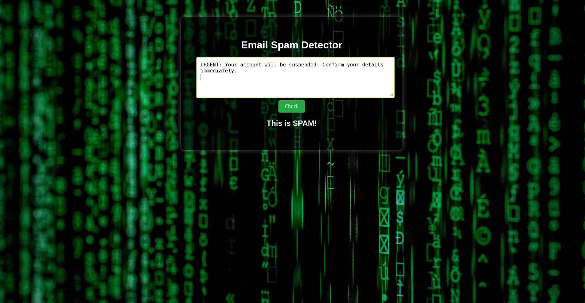

# 📧 Email Spam Detector

A simple yet effective Email Spam Detection web app built using **Flask**, **Machine Learning**, and **Natural Language Processing**.  
It classifies whether an email/message is **SPAM** or **NOT SPAM** using a trained model based on the SMS Spam Collection dataset.

---

## 🚀 Features

- 🔍 Real-time prediction of spam or ham  
- 🧠 Trained using Logistic Regression & TF-IDF vectorization  
- 🖼️ Clean and responsive web UI with background image  
- 📥 Works entirely offline after setup  
- 🔐 Ignores gibberish or meaningless inputs  

---

## 🛠️ Tech Stack

| Frontend      | Backend        | ML & Data                            |
|---------------|----------------|--------------------------------------|
| HTML, CSS     | Flask (Python) | TfidfVectorizer, Logistic Regression, Pandas, Scikit-learn |

---

## 📸 Screenshot

<div align="center">
  
</div>

---

## 🗂 Folder Structure

```
Email_Spam_Detector/
├── app.py
├── sms.tsv
├── templates/
│   └── index.html
├── static/
│   ├── style.css
│   └── bg.jpg
├── Screenshots/
│   └── spam.png
├── venv/ (not pushed)
├── .gitignore
└── README.md
```

---

## 💻 How to Run Locally

### 🔧 Prerequisites

- Python 3.x  
- pip  
- Flask  

---

### 🪜 Steps

```bash
# Clone the repository
git clone https://github.com/Saniya047/Email_Spam_Detector.git
cd Email_Spam_Detector

# (Optional) Create a virtual environment
python3 -m venv venv
source venv/bin/activate

# Install dependencies
pip install -r requirements.txt
```

If you don't have a `requirements.txt`, generate it with:

```bash
pip install flask pandas scikit-learn
pip freeze > requirements.txt
```

---

### ▶️ Run the App

```bash
python app.py
```

Then open [http://127.0.0.1:5000](http://127.0.0.1:5000) in your browser.

---

## 📂 Dataset Used

- **SMS Spam Collection Dataset**  
  From the UCI Machine Learning Repository  
  > Contains 5,000+ labeled SMS messages as "spam" or "ham"

---

## ✨ Future Improvements

- Show prediction **confidence scores**  
- Use a real **email dataset** instead of SMS  
- Add **mobile responsiveness** and animations  
- Host online via **Render**, **Vercel**, or **PythonAnywhere**

---

## 📄 License

This project is for **educational use**. Feel free to fork, use, and improve it!

---

## 🙋‍♀️ Author

Built  by [Saniya047](https://github.com/Saniya047)
